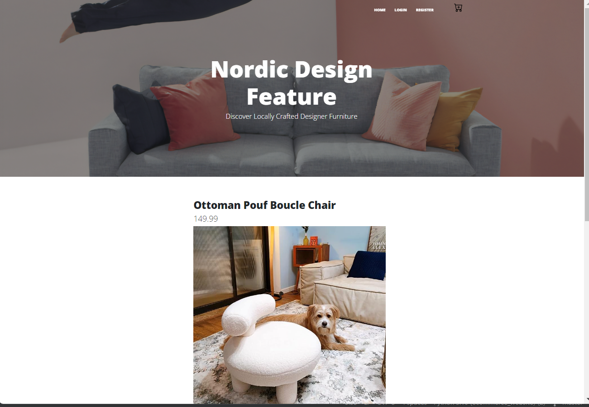
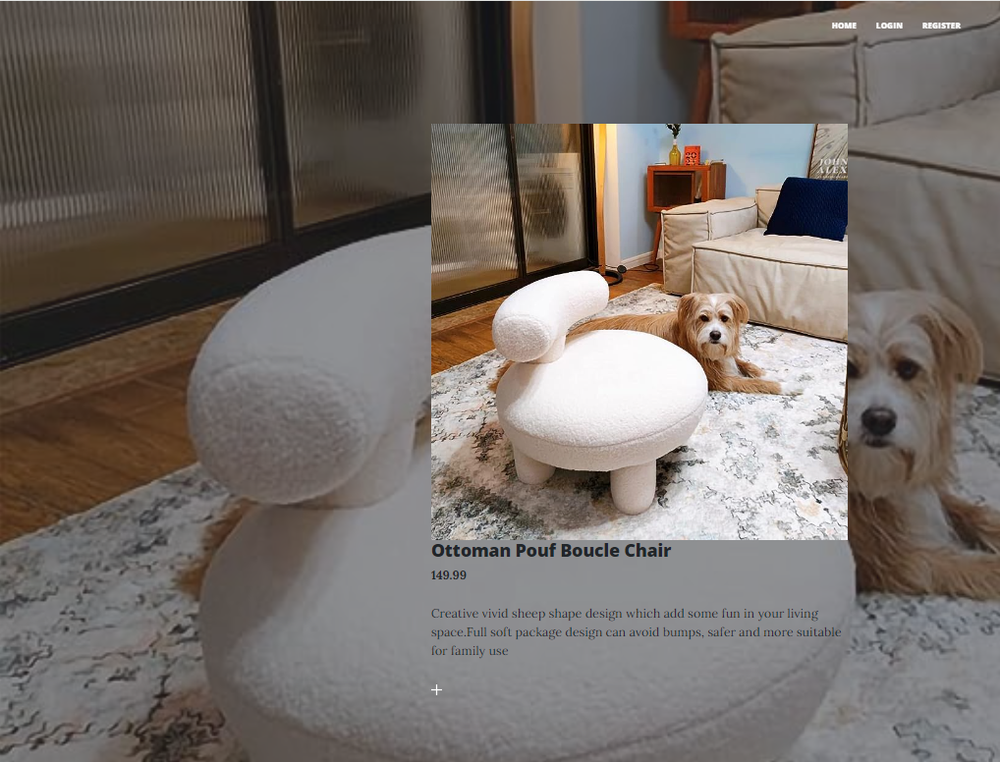
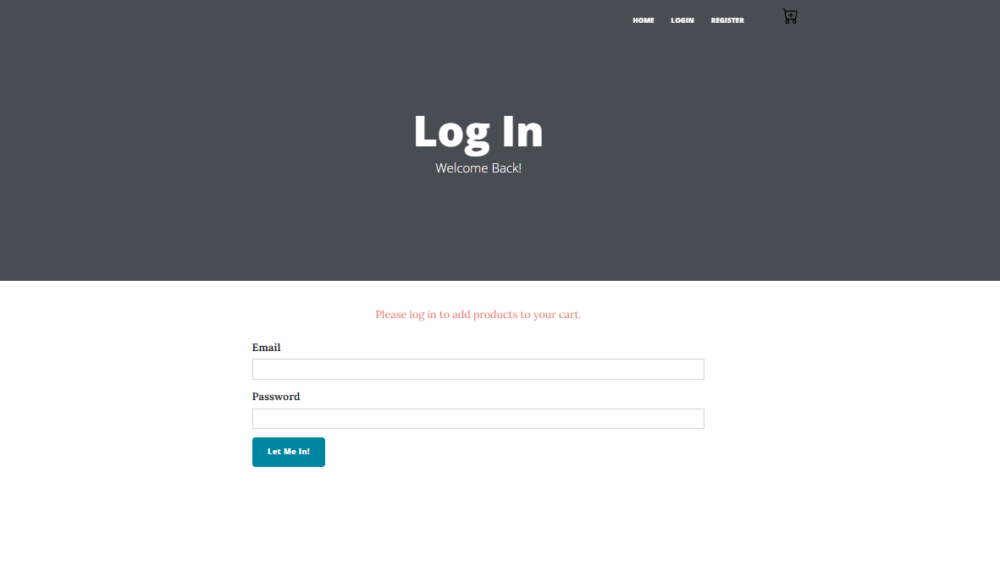
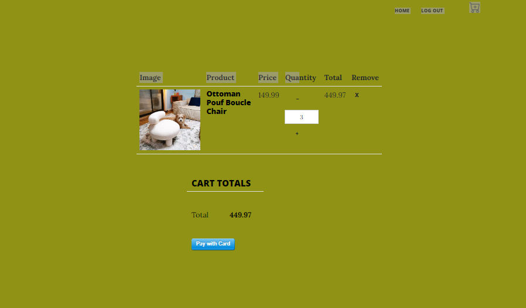
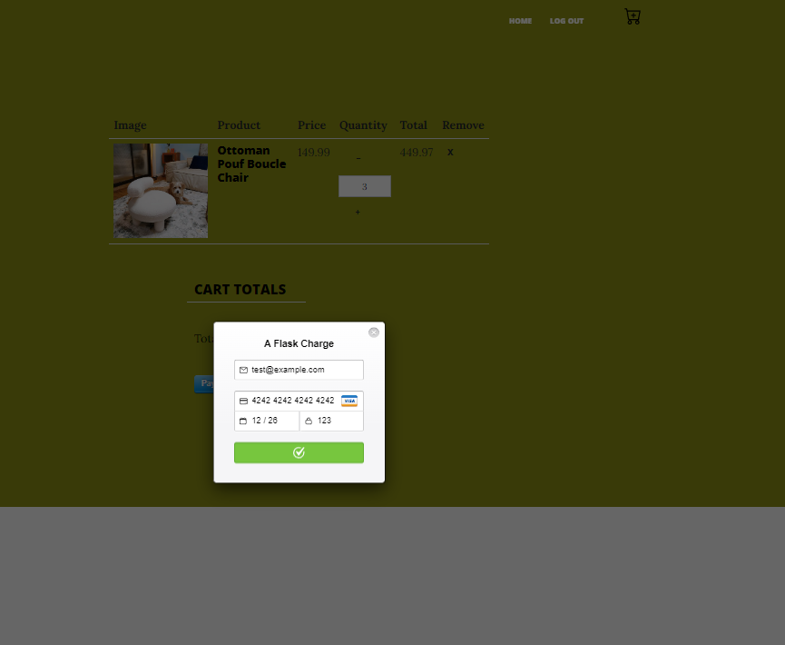
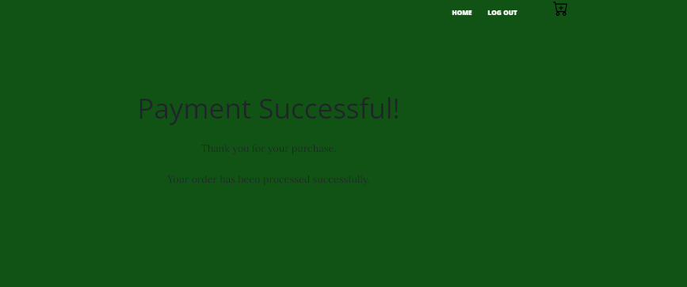

# Nordic Design Furniture eCommerce Website
Welcome to the Nordic Design Furniture eCommerce website repository! This project is a Flask-based web application that enables users to explore and purchase locally crafted designer furniture. 

## Features
- User authentication: login and registration via Flask-Login.
- Shopping cart: Add products to your cart, review your cart, and proceed to checkout.
- Checkout functionality: Checkout with real payment processing using [Stripe](https://stripe.com/docs/payments/checkout).


## Technology Used
- Flask
- Flask-Bootstrap
- Flask-Login
- SQLAlchemy
- SQLite (database)
- Stripe (payment integration)
- HTML/CSS (frontend)

 ## Getting Started
  - **Fork the repository:** You should **fork the repository** and then **clone it** so you can manage your own repo and use this only as a template.
    ```
    $ git clone https://github.com/your-username/nordic-design-furniture.git
    ```
  - **Install dependencies:**
    ```
    pip install -r requirements.txt
    ```
  - **Set Environment Variables:** Ensure you have your own 'STRIPE_PUBLIC_KEY' and STRIPE_SECRET_KEY for Stripe integration and 'ECOMMERCE_SECRET_KEY' for FLASK.
    
  - **Run the Application:**
  
      ```
       python main.py
      ```
  
  - **Access the Application:** Open your web browser and navigate to http://localhost:5000 to access the application.

## Usage:
- Navigate to the homepage to view locally crafted designer furniture.
- Explore furniture details, click on the product on the home page. Details are shown at 'http://127.0.0.1:5000/post/id'
- Login or register before show chart details.
- Add desired product into the chart by click the plus icon. the '/add' route and filling in the required details.
- Make real checkout process filling the payment details. Real Checkout is done with via Stripe. 

## Screenshots
 - **Home Page:**    
   <div align="center"></div>

 - **Product Detail:**    
   <div align="center"></div>
   
 - **Login:**    
   <div align="center"></div>

  - **Chart Detail:**   
   <div align="center"></div>

  - **Checkout Process:**    
   <div align="center"></div>
   
  - **Successful Payment:**    
   <div align="center"></div>

## Contributing
   Contributions are welcome! Please fork the repository and create a pull request with your changes.

